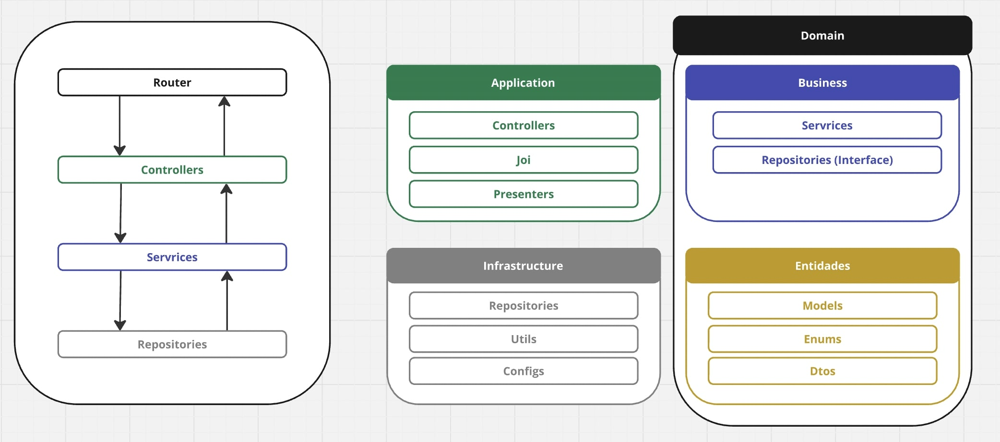

<h1 align="center">Template 👋</h1>
<p>
  
</p>

> Projeto Template.

### Documentation

#### Swagger Documentation

A doc `Swagger` pode ser acessada no endpoint `/api-docs`

#### API Documentation

A coleção do `Postman` pode ser baixada a partir do arquivo disposto na raiz do projeto `API Template.postman_collection.json`

### Global Specification:

  • NPM 9.8.1

  • Node Version: 18.15.0

  • Typescrypt ES2021

### Archtecture



### How to install Localhost:

```sh
npm i
```

### How to execute Localhost:

```sh
npm run dev
```

## How to execute tests

```sh
npm run test
```

## How to execute eslint

```sh
npm run lint:fix
```
